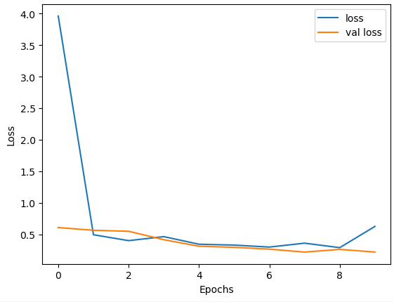
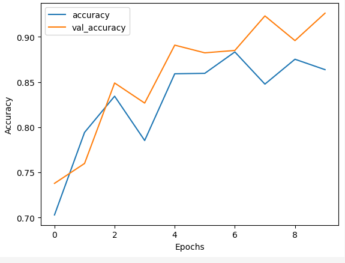
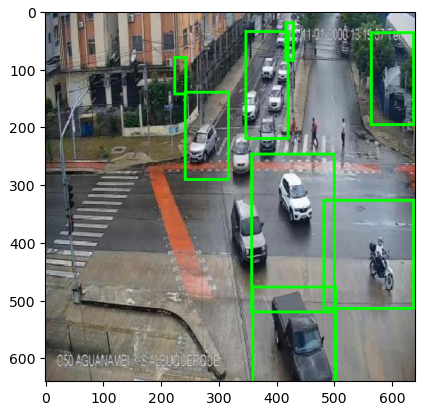
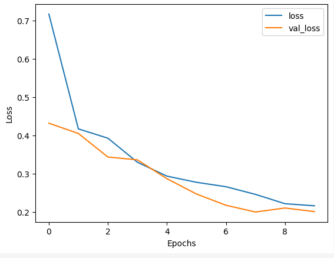
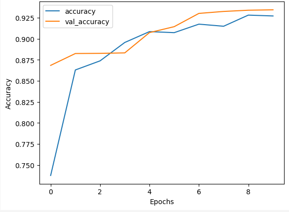
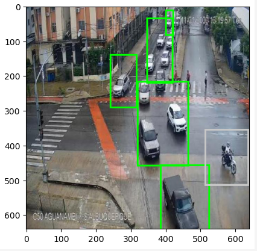

# Traffic Object Detection TensorFlow
This is a TensorFlow based object detection model for traffic.

## Region Proposal Network (Loss vs Accuracy)

## Prediction

## RCNN (Loss vs Accuracy)

## Final Prediction

